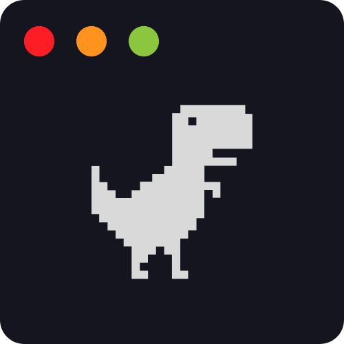
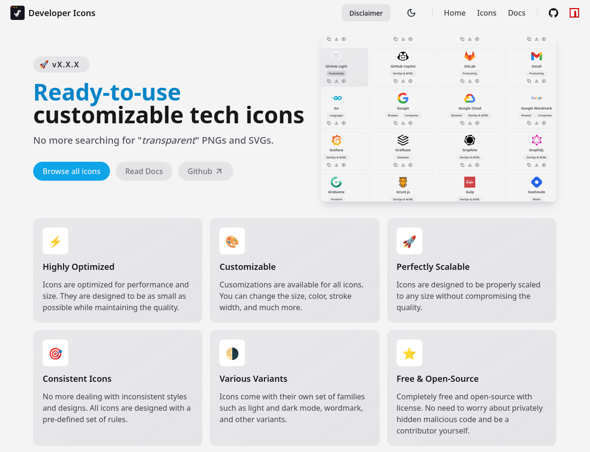

<div align="center">
  <a href="https://xandemon.github.io/developer-icons" target="_blank"></a>
  <h1>Developer Icons</h1>
</div>

<div align="center">
  <div>
    <a href="https://astro.build/" target="_blank"></a>
    <a href="https://tailwindcss.com/" target="_blank"></a>
    <a href="https://react.dev/" target="_blank"></a>
    <a href="https://github.com/xandemon/developer-icons/releases" target="_blank"></a>
    <a href="https://github.com/xandemon/developer-icons/blob/main/LICENSE" target="_blank"></a>
  </div>
  <div>
    <a href="https://www.npmjs.com/package/developer-icons" target="_blank"></a>
    <a href="https://github.com/xandemon/developer-icons/stargazers" target="_blank"></a>
    <a href="https://github.com/xandemon/developer-icons/network/dependents" target="_blank"></a>
    <a href="https://github.com/xandemon/developer-icons/stargazers" target="_blank"></a>
  </div>
 
</div>

<p align="center">
  <a href="https://xandemon.github.io/developer-icons/">Homepage</a>
  <span>&nbsp;⬥&nbsp;</span>
  <a href="https://xandemon.github.io/developer-icons/icons/All">Browse Icons</a>
  <span>&nbsp;⬥&nbsp;</span>
  <a href="https://www.npmjs.com/package/developer-icons">NPM Package</a>
  <span>&nbsp;⬥&nbsp;</span>
  <a href="https://xandemon.github.io/developer-icons/docs/usageGuide/">Usage</a>
  <span>&nbsp;⬥&nbsp;</span>
  <a href="https://xandemon.github.io/developer-icons/docs/contributing/">Contributing</a>
</p>

<p align="center">
  
</p>

Welcome to **`developer-icons`**—a curated set of high-quality, customizable tech icons built for developers and designers. Fully compatible with TypeScript, ideal for React and Next.js, or downloadable from our [official website](https://xandemon.github.io/developer-icons/icons/All "Developer Icons Website") for design projects.

## 🧑‍💻 Used by

<a href="https://github.com/xandemon/developer-icons/network/dependents" target="_blank">
  
</a>

## 🚀 Tech Stack

- [Astro](https://astro.build/) - The web framework for content-driven websites.
- [React](https://reactjs.org/) - A JavaScript UI library used with Astro.
- [Tailwind CSS](https://tailwindcss.com/) - A utility-first CSS framework for rapid UI development.
- [NPM](https://www.npmjs.com/) - The package manager for JavaScript.
- [Typescript](https://www.typescriptlang.org/) - A statically typed, superset of JavaScript.
- [Vite](https://vitejs.dev/) - A lightning-fast build tool for an optimized development experience.
- [Lucide Icons](https://lucide.dev/) - A modern, customizable, open-source icon library.
- [SVGO](https://github.com/svg/svgo) - A powerful tool for compressing and optimizing SVG files.
- [SVGSON](https://github.com/svgson/svgson) - A tool to seamlessly convert SVGs to JSON format and back.

## 🌟 Features

- ⚡ **Highly optimized:** Icons are optimized for performance and size. They are designed to be as small as possible while maintaining the quality.
- 🎨 **Customizable:** Cusomizations are available for all icons. You can change the size, color, stroke width, and much more.
- 🔍 **Perfectly scalable:** Icons are designed to be properly scaled to any size without compromising the quality.
- 🔄 **Consistent icons:** No more dealing with inconsistent styles and designs. All icons are designed with a pre-defined set of rules.
- 🌗 **Various variants:** Icons come with their own set of families such as light and dark mode, wordmark, and other variants.
- ⭐ **Free & open-source:** Completely free and open-source with license. No need to worry about privately hidden malicious code and be a contributor yourself.

Explore more and start using `developer-icons` today to enhance your projects with stunning, customizable icons!

## 📦 Installation

To add the icons to your project, run one of the following commands:

```bash
npm i developer-icons
```

or

```bash
yarn add developer-icons
```

or

```bash
pnpm add developer-icons
```

## ⚙️ Usage

Import named icon components from the `developer-icons` package and use them just like any other React component, with props/attributes similar to those of an SVG:

```javascript
import { HtmlIcon, JavascriptIcon } from "developer-icons";

//inside your React component JSX
export const YourReactComponent = () => {
  return (
    <div>
      <HtmlIcon className="html-icon" />
      <JavascriptIcon size={52} style={{ marginLeft: 20 }} />
    </div>
  );
};
```

In this example, we import `HtmlIcon` and `JavascriptIcon` from the `developer-icons` package and use them within a React component. You can customize the icons by adjusting their `size`, `color`, `style`, and other properties.

## 🤝 Contributing

We welcome contributions of all kinds, whether you're looking to add new icons, improve existing ones, or enhance the overall project. To get started, refer to our [Contributing Guidelines](https://xandemon.github.io/developer-icons/docs/contributing).

## 📜 License

Licensed under MIT License and copyrights reserved.

For complete documentation, visit our [official documentation](https://xandemon.github.io/developer-icons/docs).
